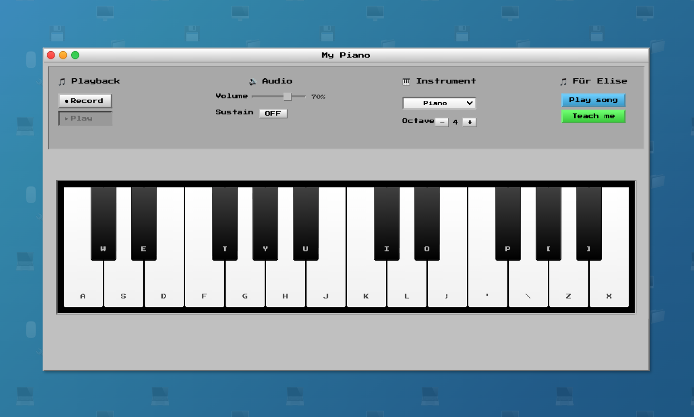

# 🎹 My Piano - Digital Piano App

A beautiful digital piano web application with Old Mac OS inspired design and interactive learning features.

## 🚀 Live Demo

**[Try My Piano App](https://cathyheng.github.io/my-piano/)**

## 📸 Screenshot

## ✨ Features

- **🎹 2-Octave Piano Keyboard** - Authentic piano layout with proper black key positioning
- **🎵 Multiple Instruments** - Piano, Electric Piano, Organ, Synthesizer, Harpsichord, Marimba  
- **📝 Record & Playback** - Record your performances and play them back
- **🎓 Interactive Teaching Mode** - Learn "Für Elise" with visual guidance and feedback
- **🎊 Confetti Celebration** - Rewarding animations when you complete songs
- **🎨 Retro Design** - Classic Mac OS System 7 inspired interface
- **⌨️ Keyboard Support** - Play with your computer keyboard or mouse
- **🔊 Audio Controls** - Volume, sustain, and octave controls

## 🎮 How to Play

### Keyboard Controls (2 Octaves)
- **White Keys**: `A` `S` `D` `F` `G` `H` `J` `K` `L` `;` `'` `\` `Z` `X`
- **Black Keys**: `W` `E` `T` `Y` `U` `O` `P` `[` `1` `2`

### Features
1. **Play Song** - Listen to "Für Elise" 
2. **Teach Me** - Interactive learning mode with visual hints
3. **Record/Play** - Capture and playback your performances
4. **Instrument Selection** - Choose from 6 different sounds
5. **Audio Controls** - Adjust volume, sustain, and octave

## 🛠️ Technologies Used

- **HTML5** - Structure and layout
- **CSS3** - Styling with classic Mac OS design
- **JavaScript** - Interactive functionality and Web Audio API
- **Web Audio API** - Real-time sound synthesis

## 📱 Responsive Design

Works perfectly on desktop, tablet, and mobile devices with responsive controls and layouts.

## 🎯 Perfect For

- Music learning and practice
- Casual piano playing
- Retro computing nostalgia
- Interactive music education

---

Made with ❤️ for music lovers and retro computing enthusiasts!
